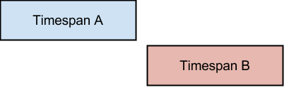
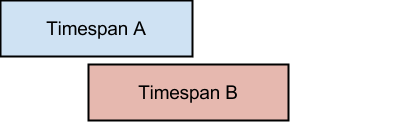
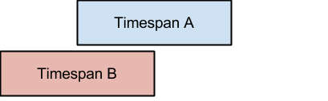
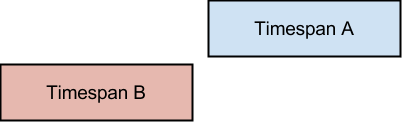
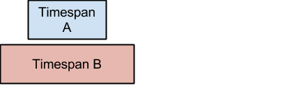
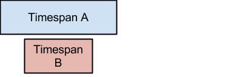
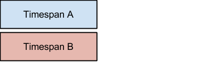

# Scenarios of Two Timespans

There are 7 general cases for 2 timespans in relation to each other.

## Scenario 1

*No Overlap*

## Scenario 2

*Overlap*

## Scenario 3

*Overlap*

## Scenario 4

*No Overlap*

## Scenario 5

*Overlap*

## Scenario 6

*Overlap*

## Scenario 7

*Overlap*

